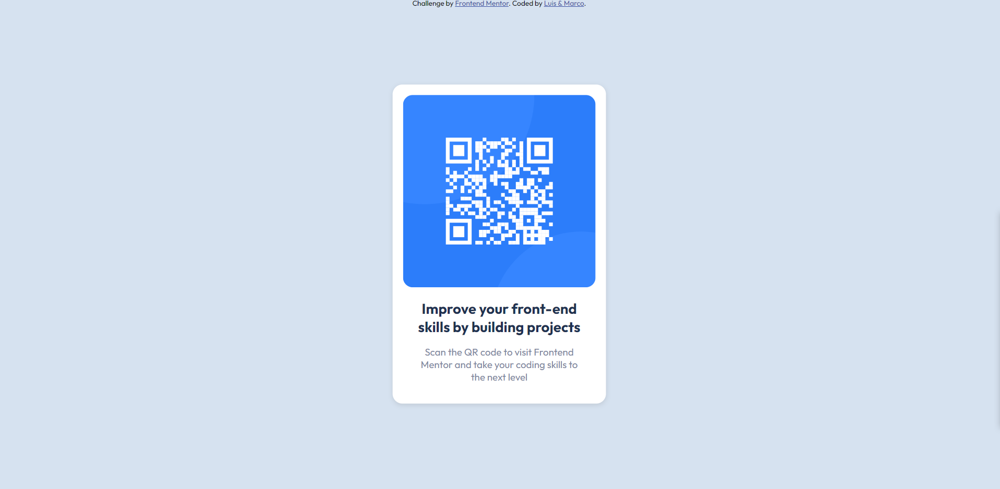
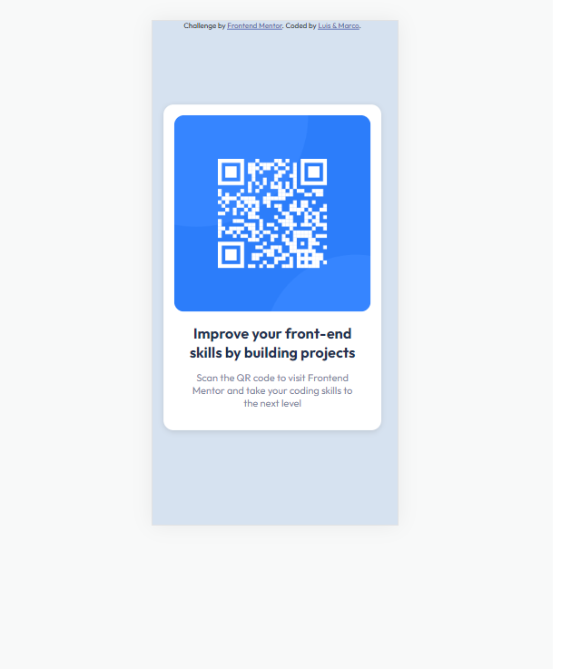

# Frontend Mentor - QR code component solution

This is a solution to the [QR code component challenge on Frontend Mentor](https://www.frontendmentor.io/challenges/qr-code-component-iux_sIO_H). Frontend Mentor challenges help you improve your coding skills by building realistic projects.

## Table of contents

- [Overview](#overview)
  - [Screenshot](#screenshot)
  - [Links](#links)
- [My process](#my-process)
  - [Built with](#built-with)
  - [What I learned](#what-i-learned)
  - [Useful resources](#useful-resources)
- [Author](#author)

## Overview

### Screenshot




### Links

- Solution URL: [Solution URL here](https://github.com/hkmarcoot/fementor-qr-code)
- Live Site URL: [Live site URL here](https://hkmarcoot.github.io/fementor-qr-code)

## My process

### Built with

- Semantic HTML5 markup
- CSS custom properties
- Mobile-first workflow

### What I learned

-Center containers horizontally and vertically.
-Apply box shadow.
-Use root variables.

```css
.all-container {
  width: 375px;
  margin: 0;
  position: absolute;
  top: 50%;
  left: 50%;
  transform: translate(-50%, -50%);
}
```

### Useful resources

- [Center](https://www.w3schools.com/css/css_align.asp) - This helped me to center the main container vertically and horinzontally.

## Authors

- Website - [Marco Tsang](https://www.linkedin.com/in/marco-tsang112)
- Frontend Mentor - [@hkmarcoot](https://www.frontendmentor.io/profile/hkmarcoot)
- Twitter - [@marcotsang112](https://www.twitter.com/marcotsang112)

- Website - [Luis Rodrigues](https://www.linkedin.com/in/withluis/)
- Frontend Mentor - [@Luis0lo](https://www.frontendmentor.io/profile/Luis0lo)
- Twitter - [@withluis1](https://twitter.com/withluis1)
